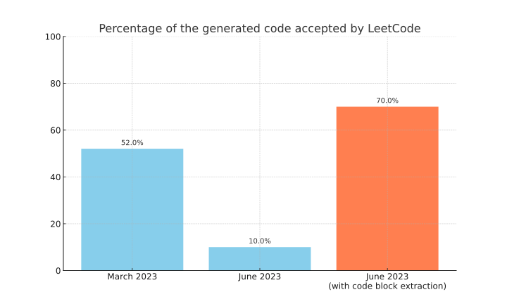

# Is GPT-4 really getting worse at coding?

This repository analyzes the experimental results from the paper "[How is ChatGPT's behavior changing over time?](https://arxiv.org/abs/2307.09009)".
To be speficic, here we focus on the code generation dataset found in [their GitHub repository](https://github.com/lchen001/LLMDrift).

While they claim that the percentage of "directly executable code" generated by GPT-4 dropped from 52.0% in March to 10.0% in June, it doesn't mean the June version writes worse code.
With a simple regex post-processing of the generated code, the June version actually achieves 
70% acceptance rate. (You can check out the full result in [output.json](output.json).)



## Motivation
As to why the accuracy of code generation decline in the June version, the paper says:

> One possible explanation is that the June versions consistently added extra non-code text to their generations. Figure 4 (b) gives one such instance. GPT-4’s generations in March and June are almost the same except two parts. First, the June version added “‘python and “‘ before and after the code snippet. Second, it also generated a few more comments. While a small change, the extra triple quotes render the code not executable. This is particularly challenging to identify when LLM’s generated code is used inside a larger software pipeline.

Here is an example generation enclosed in the triple quotes:

````markdown
```python
class Solution(object):
    def isFascinating(self, n):
        # Concatenate n, 2*n and 3*n
        s = str(n) + str(n*2) + str(n*3)
        # Check if the length of s is 9 and contains all digits from 1 to 9
        return len(s) == 9 and set(s) == set('123456789')
```
````

Instead of evaluating the whole LLM response, what if we extract the enclosed code using simple regex? This repository does just that.

## Attribution
The file [data/LEETCODE_EASY_EVAL.csv](data/LEETCODE_EASY_EVAL.csv) was copied from [lchen001/LLMDrift](https://github.com/lchen001/LLMDrift), which is licensed under the Apache-2.0 license.
A copy of the License can be found in the [LICENSE](LICENSE) file.
